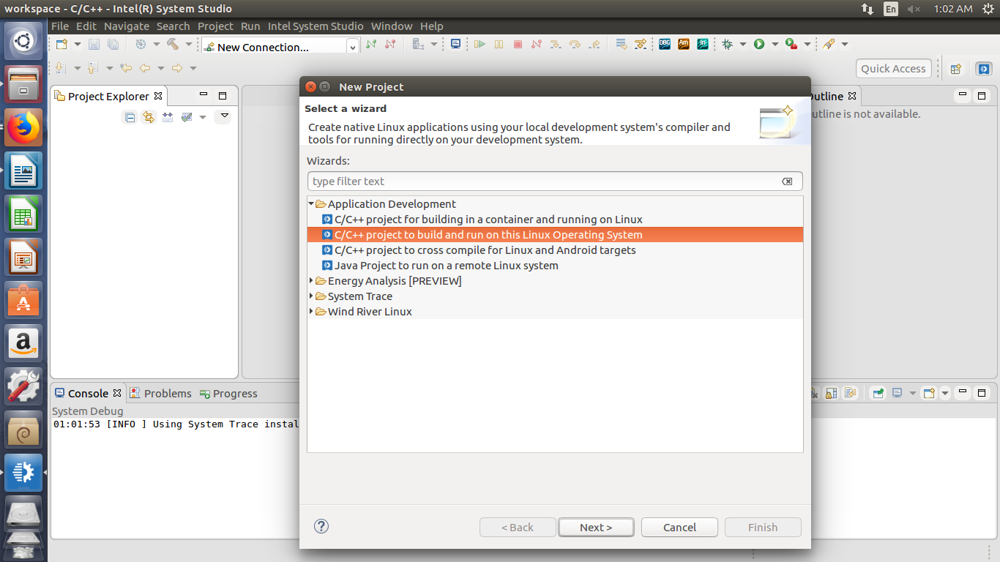
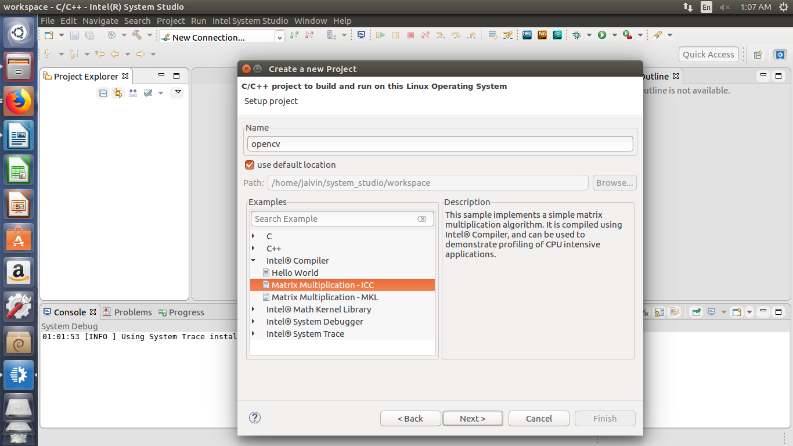
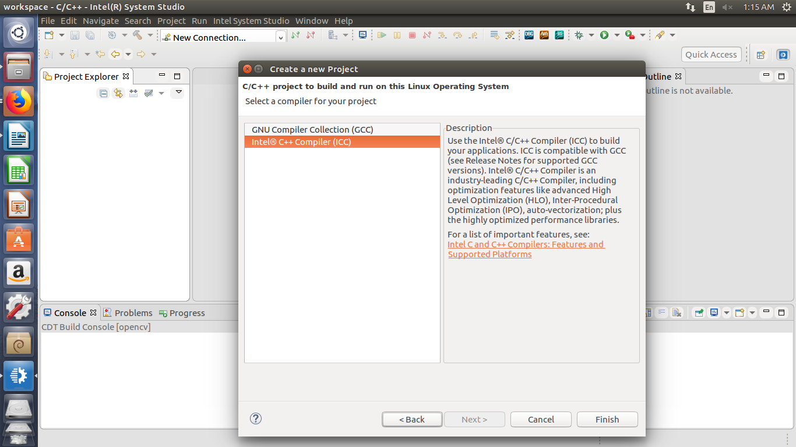
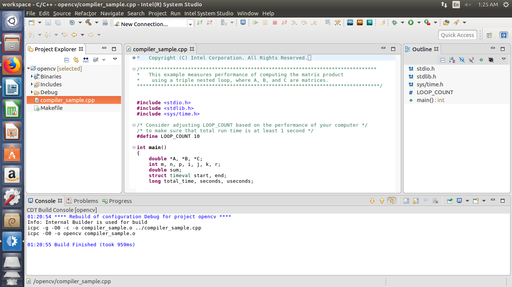
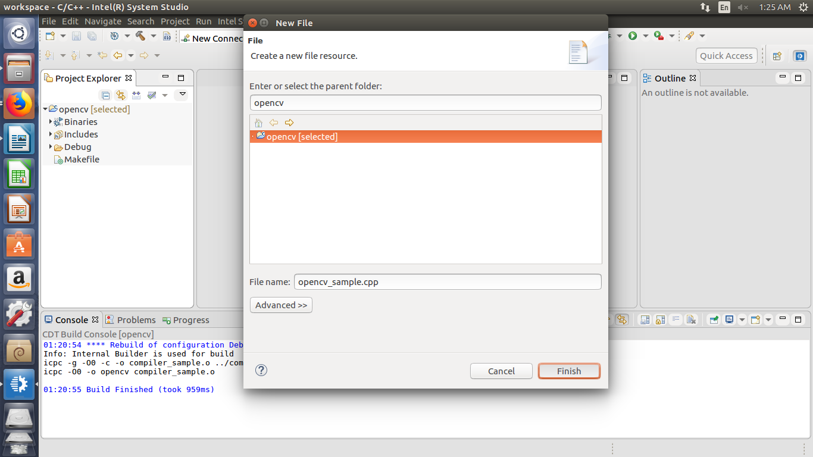
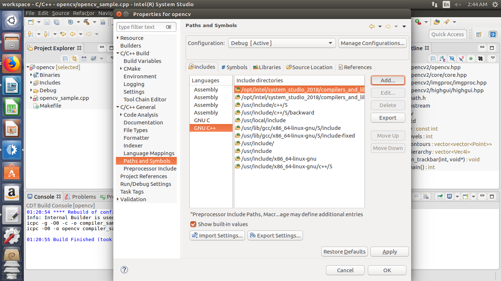
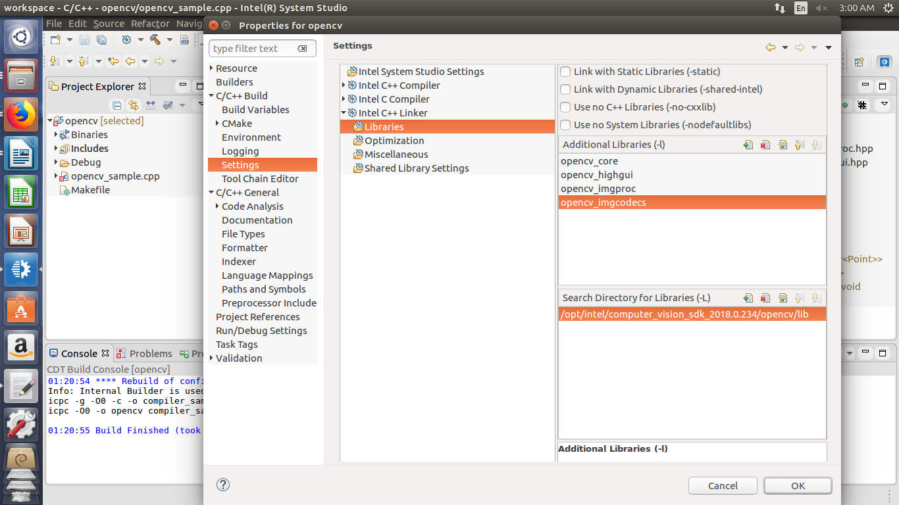
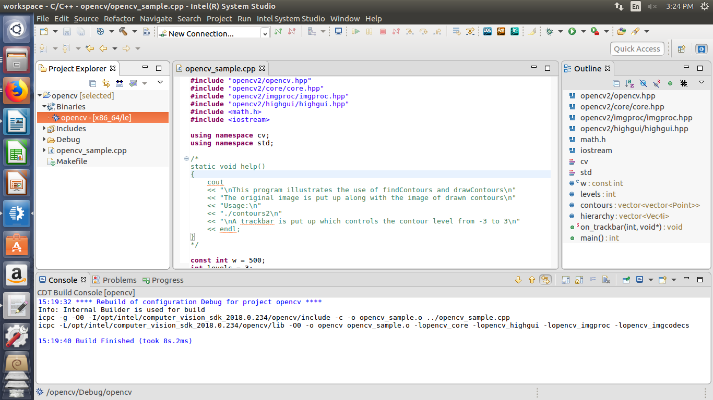
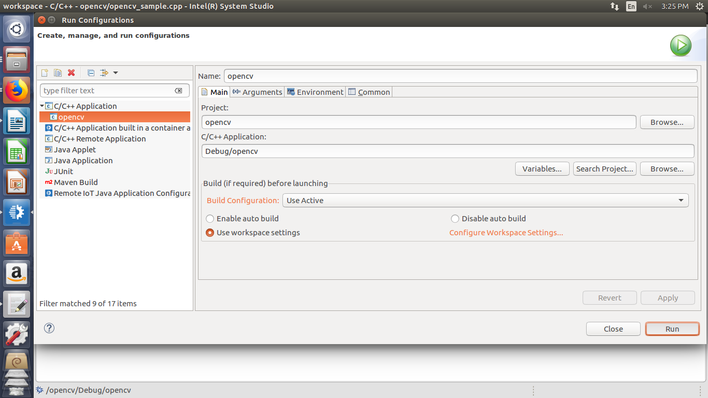

# DISCONTINUATION OF PROJECT #
This project will no longer be maintained by Intel.
Intel has ceased development and contributions including, but not limited to, maintenance, bug fixes, new releases, or updates, to this project.
Intel no longer accepts patches to this project.
# OpenVINO™ with Intel® System Studio

| Programming Language |  C++ |
| --- | --- |
| Skills (beg, intermediate, advanced) |  Intermediate |
| Time to complete project (in increments of 15 min) |   |
| Hardware needed (hardware used) | UP Squared* Grove IoT Development Kit |
| Target Operating System | Ubuntu* 16.04  |

The OpenVINO™ toolkit is a toolkit for developing applications and solutions that emulate human vision. It
includes optimized calls for OpenCV, the main library used for computer vision and image processing.

This tutorial contains instructions to use OpenVINO™ with Intel® System Studio 2018, update 1 for executing OpenCV projects.

## What you'll Learn

-   How to Download and install the OpenCV libraries.
-   Verify your OpenVINO™ installation in Intel® System Studio 2018.

## Gather Your Materials

-   Host Computer with Intel® System Studio 2018 installed (OS : Ubuntu* 16.04 LTS)
-   UP Squared* Board with Ubuntu* 16.04 LTS
-   A monitor, keyboard, and mouse for the UP Squared* board

## Setup

Connect a monitor, keyboard, and mouse before proceeding.

**Note:** the username and password are both *upsquared*

## Download
To Download OpenVINO™ (*for both host & UP Squared* board*):
<https://software.intel.com/en-us/computer-vision-sdk> 
(Select **Choose & Download** and Click Linux )

Follow the steps in the link to complete Installation :
<https://software.intel.com/en-us/articles/CVSDK-Install-Linux>


## To Build OpenCV applications on Intel® System Studio

From the Host system, open Intel® System Studio and choose your workspace.

### To start a new Project 
Click **File -&gt; New -&gt; Project -&gt; Application Development**



Select **C/C++ project to build and run on this Linux Operating System.**

Name your project and select **Intel Complier -&gt; Matrix Multiplication -ICC** as an Example.



Click **Next.** Select Complier and **Finish.**



The Example code has built.

Delete the file named **compiler\_sample.cpp** (example code) from the Project Explorer.



Click **File -&gt; New -&gt; File**. Select the parent Folder and name the new file (with a .cpp extension).



Copy the program to the newly created file.

### To add CV SDK Libraries & Include Paths:

Select **Project -&gt; Properties -&gt; C/C++ General -&gt; Paths and Symbols**

Select **Includes -&gt; GNU C++** and Click on **Add..**



Select Opencv **includes path** on CV SDK:

*opt/intel/computer\_vision\_sdk\_&lt;version&gt;/opencv/include*

Click **Apply** and **OK**.

### To Add Libraries

Select **Project -&gt; Properties -&gt; C/C++ Build -&gt; Settings -&gt; C++ Linker -&gt; Libraries**

Select Opencv **Library path** on CV SDK :

   *opt/intel/computer\_vision\_sdk\_&lt;version&gt;/opencv/lib*

   Add desired libraries according to the program as shown.

   For Example: *opencv\_core, opencv\_highgui, opencv\_imgproc* etc.



Click **Apply** and **OK**.

### To Build the Project:

Select **Project -&gt; Clean..** (Select Start a build immediately) and click **OK.**

Upon successful completion, a **Binary file is created** and appears on the Project Explorer.



### To Run the Project:

1\. To Run the Project on the Host system.



   Select **Run -&gt; Run Configurations.. -&gt; C/C++ Application -&gt;**
   Choose project. Select **Search Project .. -&gt;** Choose Binaries (binaries have same name as that of the project ). Click **Run.**

2\. To Run the Project on the Target system (UP Squared* Grove IoT Development Kit).

   Select **Run -&gt; Run Configurations.. -&gt; C/C++ Remote Application -&gt;** Choose project.

   Select **Search Project.. -&gt;** Choose Binaries (binaries have the same name as the project).

### To setup Connection follow the link for Remote Debugging (Step 5 onwards)

<https://software.intel.com/en-us/developing-projects-with-intel-system-studio-c-debugging-arduino-create-projects>

**Note**: To Generate SSH keys for a Linux* target using the Intel® System Studio, refer to:

<https://software.intel.com/en-us/developing-projects-with-intel-system-studio-c-creating-an-ssh-connection>

## Troubleshoot:

When you click Run, an error may indicates there was an error while loading shared libraries: 

    libopencv\_core.so.3.4: cannot open shared object
    file: No such file or directory.

Follow these steps:

1\. Find the folder containing the shared library **libopencv\_core.so.3.4** using the following command line.

```sudo find / -name "libopencv\_core.so.3.4\*"* ```

2\. Create a file "opencv.conf" in /etc/ld.so.conf.d/

```nano /etc/ld.so.conf.d/opencv.conf```   

Write the path in this file, where the binary is stored.

```/usr/local/lib/```

3\. Run the command line as follows.*

```sudo ldconfig -v```

4\. Try to run the binary again.


